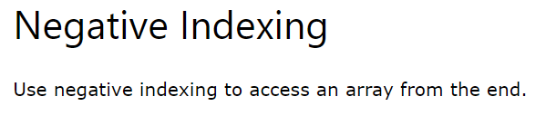

# NumPy
- 
- Example:
    - 
- 
- 
- 
- Locality of Reference refers to the tendency of the computer program to access instructions whose addresses are near one another.
- 
- 
# NumPy: Creating Arrays
- 
- 
- 
- 
- 
- 
- 
- 
- 
- 
- 
- 
- 
- 
- 
- 
- 
- 
- 
# NumPy Array Indexing:
- 
- 
- 
- 
- 
- 
- 
- 
- 
- 
- 
- 
# NumPy Array Slicing:
- 
- 
- 
- 
- 
- 
- 
- 
- 
- 
- 
- 
- 
# NumPy Datatypes
- 
- 
- 
- 
- 
- 
- 
- Note: 
- 
- 
- 
- 