# NumPy Day 2
## NumPy Array Copy vs View
- 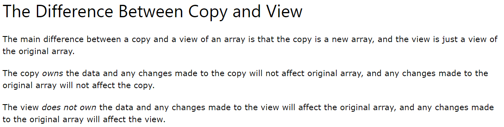
- 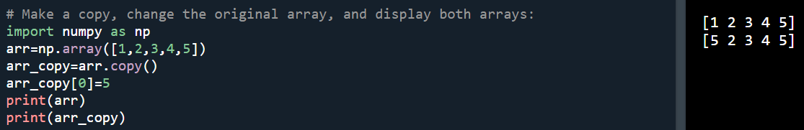
- 
- 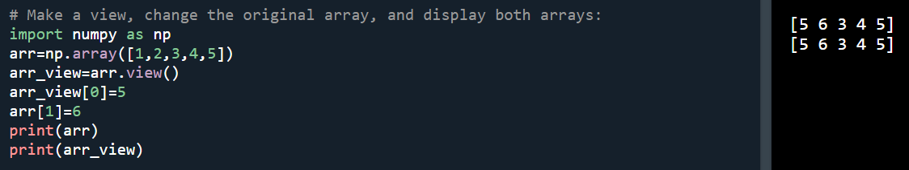
- 
- 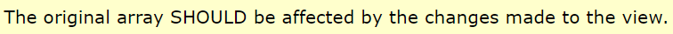
- 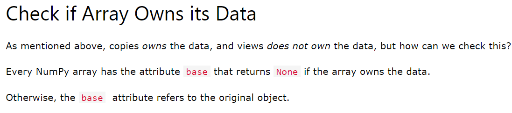
- Note: copy returns None, and view returns the original array in which view array is created.
- 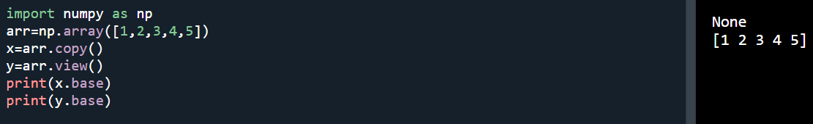
- 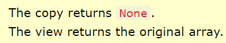
## NumPy Array Shape
- Note: 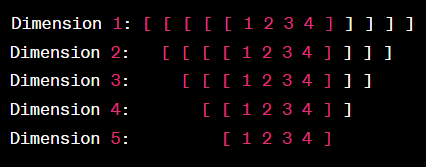
- 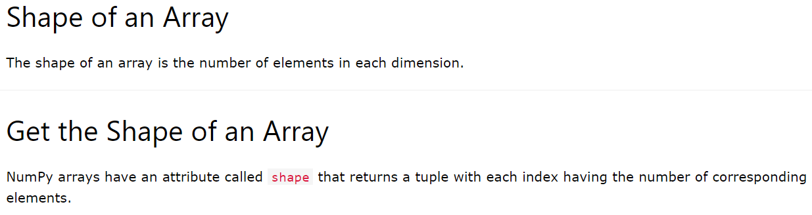
- 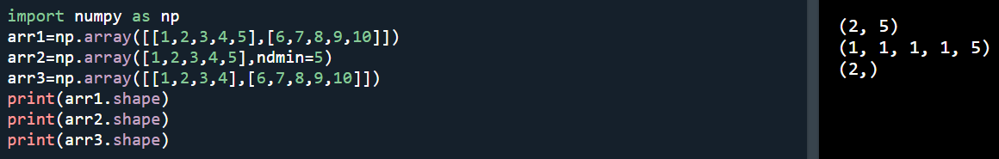
- 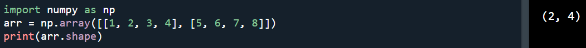
- 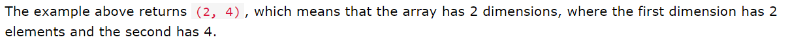
- 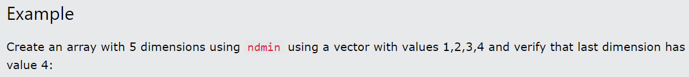
- 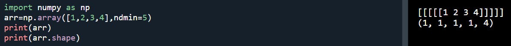
- 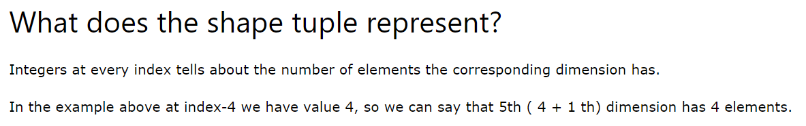
- 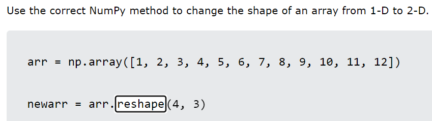 Output: 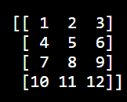
- 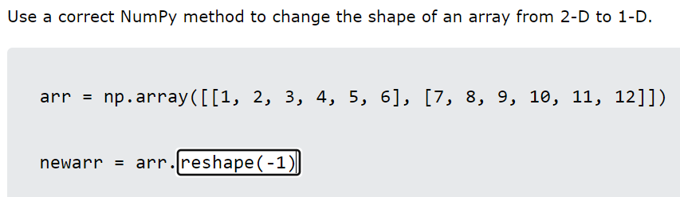 Output: 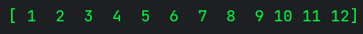
