# NumPy array reshaping:
- 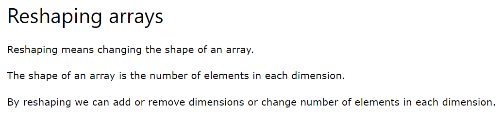
- 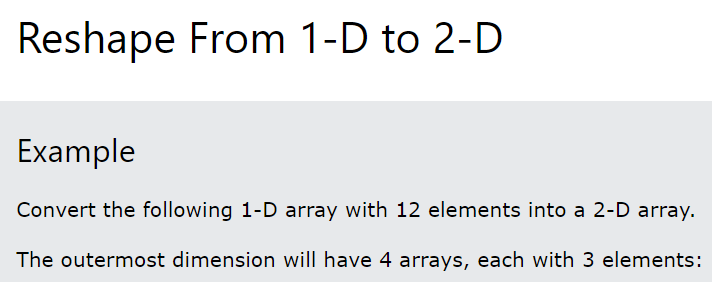
- 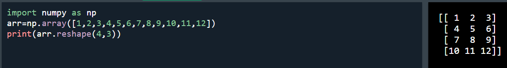
- 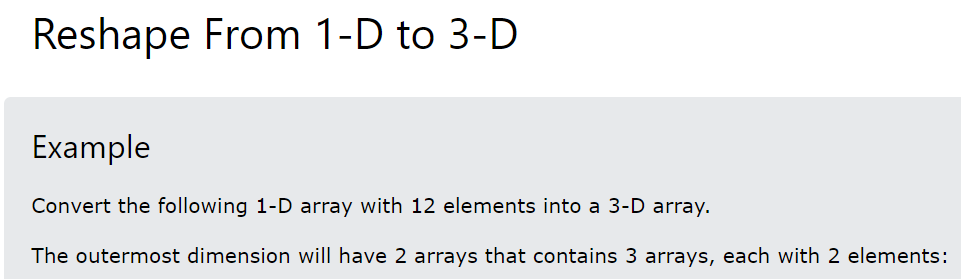
- 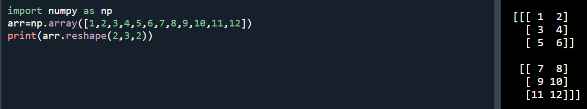
- 
- 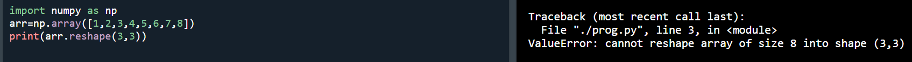
# Returns copy or view:
- 
- 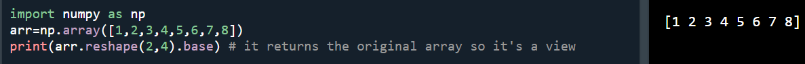
# Unknown dimension:
- 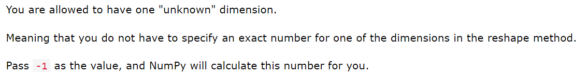
- 
- 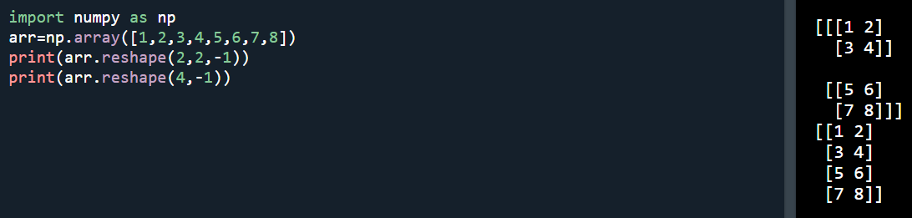
- Note: We cannot pass -1 to more than one dimension.
# Flattening the arrays:
- 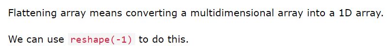
- 
# NumPy array iterating:
- 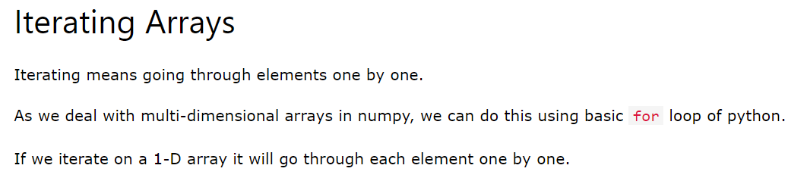
- 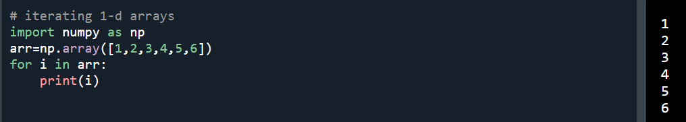
- 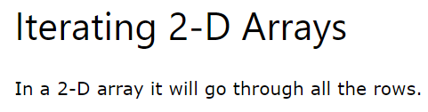
- 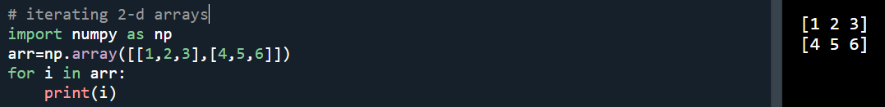
- Note: 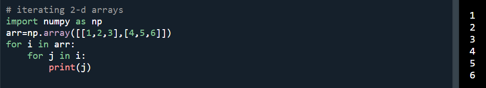
- 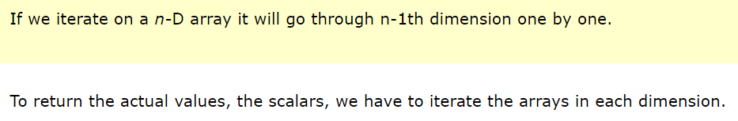
- 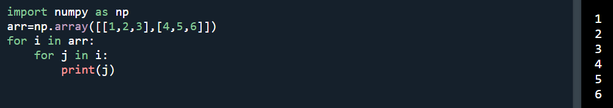
- 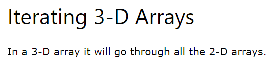
- 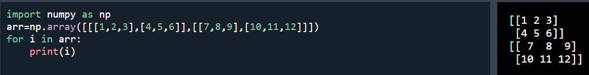
- 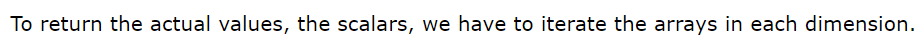
- 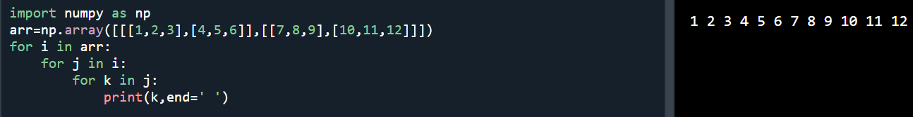
- 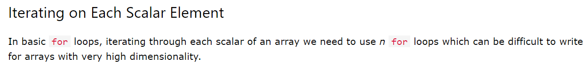
- 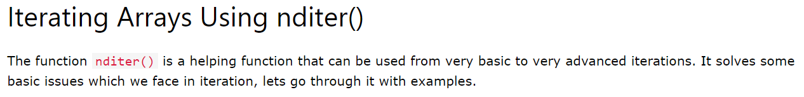
- 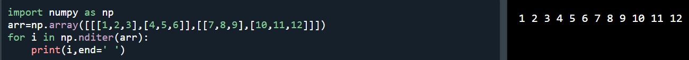
- 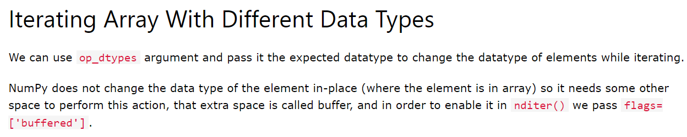
- 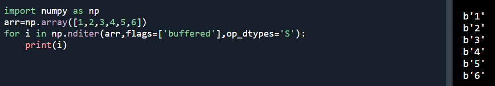
- Note: solution from gpt 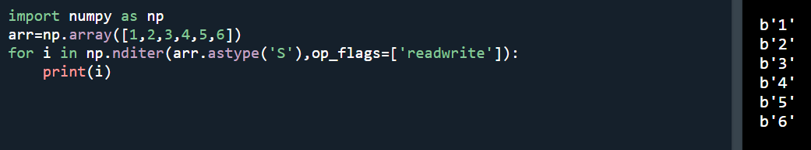
- 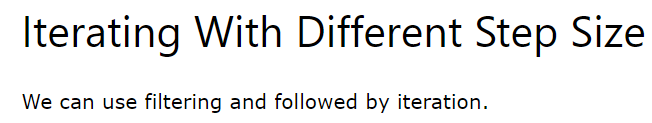
- 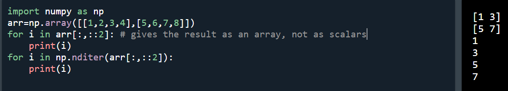
- 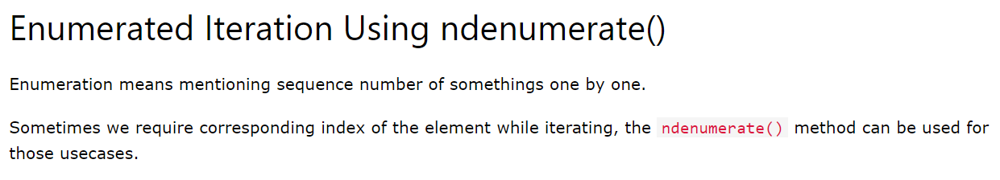
- 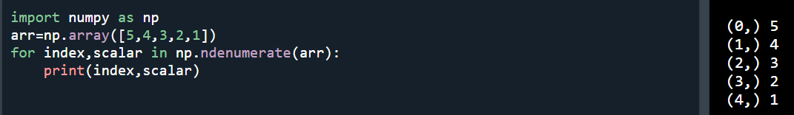
- 
- 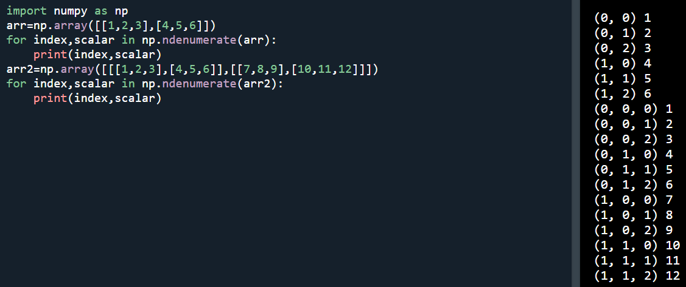