# Random Numbers in NumPy
## What is a Random Number?

## Pseudo Random and True Random.
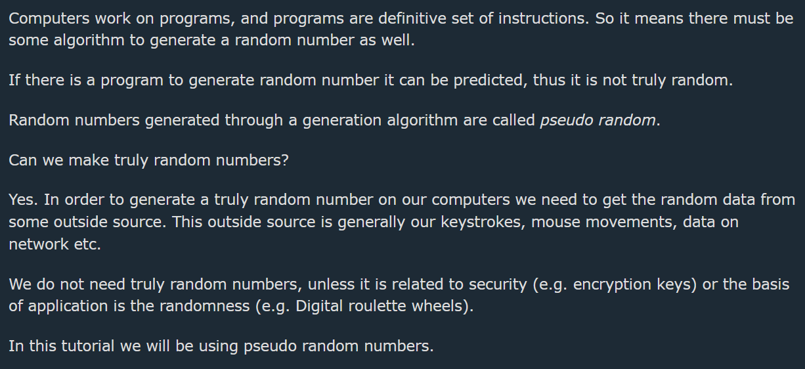
## Generate Random Number

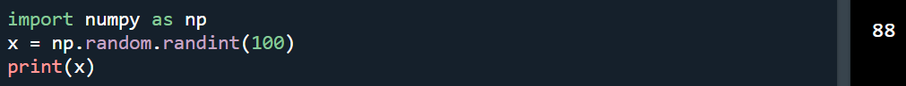
## Generate Random Float

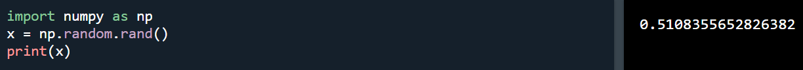
## Generate Random Array
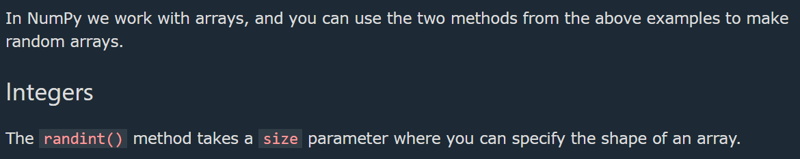

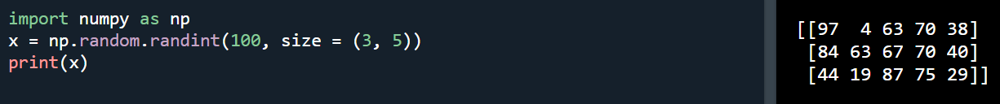
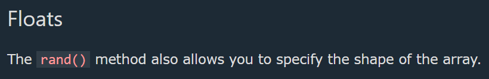

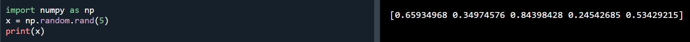

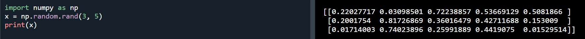
## Generate Random Number From Array

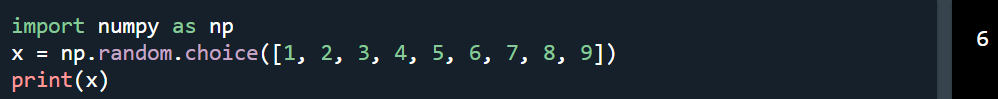

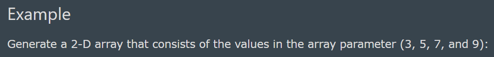
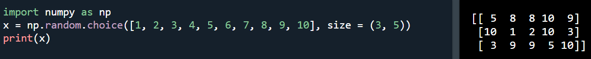