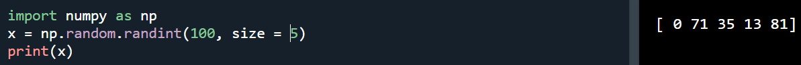

# Random Numbers in NumPy
## What is a Random Number?

## Pseudo Random and True Random.

## Generate Random Number

## Generate Random Float

## Generate Random Array

## Generate Random Number From Array

