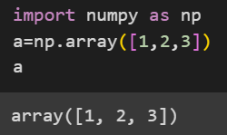

# Numpy 
- stands for NumericalPython
- used for scientific computing in python
- is a linear algebra library in python
- used to perform mathematical and logical operations on arrays
- provides features for matrix operations

# note 
- things that can be done in colab
- 
- can add images too using
```

```
# declaring numpy 1d variable:
- 
-  
- check the output when print is used and when not used
# 2d arrays:
- 
# how lists are differnet from numpy?
- lists are slow 
- numpy : fast
# note
- lists can have different datatypes
- numpy arrays can only have one type of datatype
- 
- 
- 
- 
- 
- 
- 
- 
- 
- 
- 